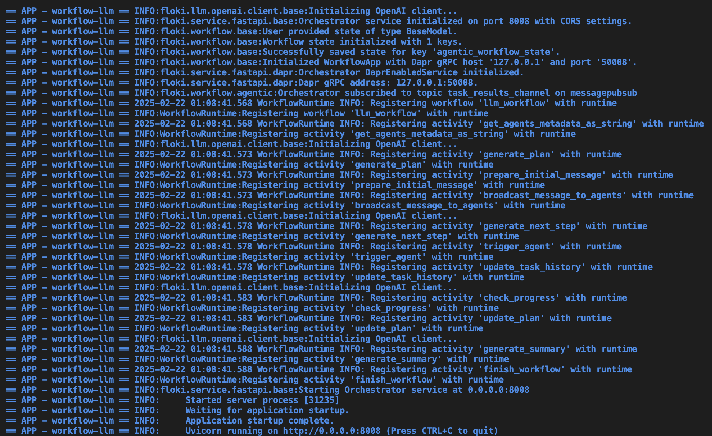
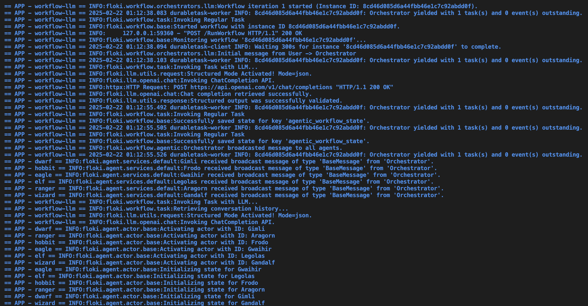
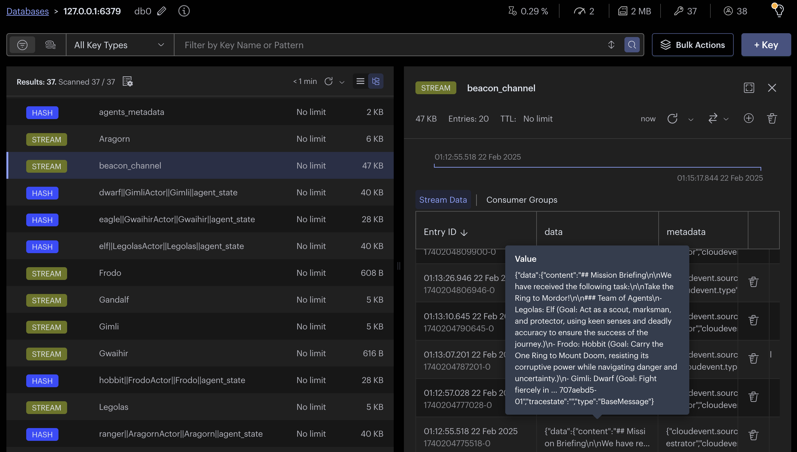
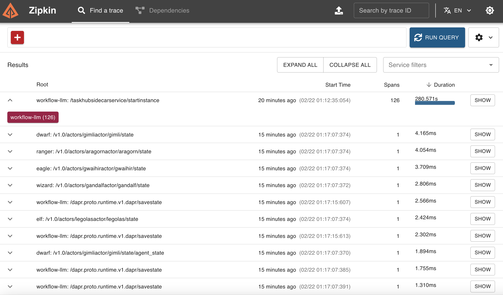
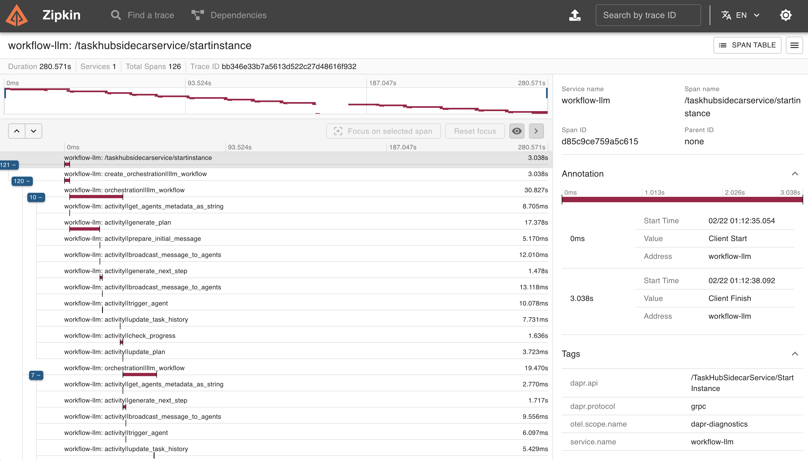
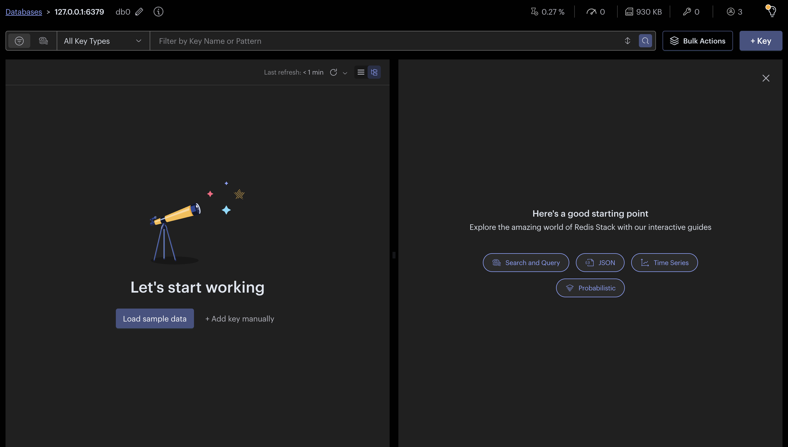

# Agentic Workflows

!!! info
    This quickstart requires `Dapr CLI` and `Docker`. You must have your [local Dapr environment set up](../installation.md).

Traditional workflows follow fixed, step-by-step processes, while autonomous agents make real-time decisions based on reasoning and available data. Agentic workflows combine the best of both approaches, integrating structured execution with reasoning loops to enable more adaptive decision-making.

This allows systems to analyze information, adjust to new conditions, and refine actions dynamically rather than strictly following a predefined sequence. By incorporating planning, feedback loops, and model-driven adjustments, agentic workflows provide both scalability and predictability while still allowing for autonomous adaptation.

In `Floki`, agentic workflows leverage LLM-based tasks, reasoning loop patterns, and an event-driven system powered by pub/sub messaging and a shared message bus. Agents operate autonomously, responding to events in real time, making decisions, and collaborating dynamically. This makes the system highly adaptable—agents can communicate, share tasks, and adjust based on new information, ensuring fluid coordination across distributed environments. This approach is particularly useful for decentralized systems that require flexible, intelligent collaboration across multiple agents and applications.

!!! tip
    We will demonstrate this concept using the [Multi-Agent Workflow Guide](https://github.com/Cyb3rWard0g/floki/tree/main/cookbook/workflows/multi_agent_lotr) from our Cookbook, which outlines a step-by-step guide to implementing a basic agentic workflow.

## Agents as Services

In `Floki`, agents can be exposed as services, making them reusable, modular, and easy to integrate into agentic workflows. Each agent runs as a microservice, wrapped in a [Dapr-enabled FastAPI server](https://docs.dapr.io/developing-applications/sdks/python/python-sdk-extensions/python-fastapi/). This design allows agents to operate independently while communicating through [Dapr’s pub/sub](https://docs.dapr.io/developing-applications/building-blocks/pubsub/pubsub-overview/) messaging and interacting with state stores or other services.

The way to structure such a project is straightforward. We organize our services into a directory that contains individual folders for each agent, along with a `components` directory for Dapr resources configurations. Each agent service includes its own app.py file, where the FastAPI server and the agent logic are defined.

```
dapr.yaml                  # Dapr main config file
components/                # Dapr resource files
├── statestore.yaml        # State store configuration
├── pubsub.yaml            # Pub/Sub configuration
└── ...                    # Other Dapr components
services/                  # Directory for agent services
├── agent1/                # First agent's service
│   ├── app.py             # FastAPI app for agent1
│   └── ...                # Additional agent1 files
│── agent2/                # Second agent's service
│   ├── app.py             # FastAPI app for agent2
│   └── ...                # Additional agent2 files
└── ...                    # More agents
```

## Set Up an Environment Variables File

This example uses our default `LLM Orchestrator`. Therefore, you have to create an `.env` file to securely store your Inference Service (i.e. OpenAI) API keys and other sensitive information. For example:

```
OPENAI_API_KEY="your-api-key"
OPENAI_BASE_URL="https://api.openai.com/v1"
```

## Define Your First Agent Service

Let's start by definining a `Hobbit` service with a specific `name`, `role`, `goal` and `instructions`.

```
services/                  # Directory for agent services
├── hobbit/                # Hobbit Service
│   ├── app.py             # Dapr Enabled FastAPI app for Hobbit
```

Create the `app.py` script and provide the following information.

```python
from floki import Agent, AgentService
from dotenv import load_dotenv
import asyncio
import logging

async def main():
    try:
        # Define Agent
        hobbit_agent = Agent(
            role="Hobbit",
            name="Frodo",
            goal="Carry the One Ring to Mount Doom, resisting its corruptive power while navigating danger and uncertainty.",
            instructions=[
                "Speak like Frodo, with humility, determination, and a growing sense of resolve.",
                "Endure hardships and temptations, staying true to the mission even when faced with doubt.",
                "Seek guidance and trust allies, but bear the ultimate burden alone when necessary.",
                "Move carefully through enemy-infested lands, avoiding unnecessary risks.",
                "Respond concisely, accurately, and relevantly, ensuring clarity and strict alignment with the task."
            ]
        )
        
        # Expose Agent as an Actor over a Service
        hobbit_service = AgentService(
            agent=hobbit_agent,
            message_bus_name="messagepubsub",
            agents_state_store_name="agentstatestore",
            port=8001,
            daprGrpcPort=50001
        )

        await hobbit_service.start()
    except Exception as e:
        print(f"Error starting service: {e}")

if __name__ == "__main__":
    load_dotenv()

    logging.basicConfig(level=logging.INFO)

    asyncio.run(main())
```

Now, you can define multiple services following this format, but it's essential to pay attention to key areas to ensure everything runs smoothly. Specifically, focus on correctly configuring the components (e.g., `statestore` and `pubsub` names) and incrementing the ports for each service.

Key Considerations:

* Ensure the `message_bus_name` matches the `pub/sub` component name in your `pubsub.yaml` file.
* Verify the `agents_state_store_name` matches the state store component defined in your `agentstate.yaml` file.
* Increment the port for each new agent service (e.g., 8001, 8002, 8003).
* Similarly, increment the `daprGrpcPort` for each service (e.g., 50001, 50002, 50003) to avoid conflicts.
* Customize the Agent parameters (`role`, `name`, `goal`, and `instructions`) to match the behavior you want for each service.

## The Agentic Workflow Service

The Agentic Workflow Service in `Floki` extends workflows to orchestrate communication among agents. It allows you to send messages to agents to trigger their participation and monitors a shared message bus to listen for all messages being passed. This enables dynamic collaboration and task distribution among agents.

Types of Agentic Workflows:

### Orchestrators

At the moment, `Floki` uses `Agentic Workflow` services to describe the orchestrator of an agentic system. We can also define the `Agent` itself as an agentic workflow (more on this coming soon...)

* **Random**: Distributes tasks to agents randomly, ensuring a non-deterministic selection of participating agents for each task.
* **RoundRobin**: Cycles through agents in a fixed order, ensuring each agent has an equal opportunity to participate in tasks.
* **LLM-based**: Leverages an LLM to decide which agent to trigger based on the content and context of the task and chat history.

Next, we’ll define an `LLM Orchestrator` to demonstrate how this concept can be implemented.

```python
from floki import LLMOrchestrator
from dotenv import load_dotenv
import asyncio
import logging

async def main():
    try:
        agentic_orchestrator = LLMOrchestrator(
            name="Orchestrator",
            message_bus_name="messagepubsub",
            agents_registry_store_name="agentstatestore",
            state_store_name="agenticworkflowstate",
            port=8008,
            daprGrpcPort=50008,
            max_iterations=25
        )

        await agentic_orchestrator.start()
    except Exception as e:
        print(f"Error starting service: {e}")

if __name__ == "__main__":
    load_dotenv()

    logging.basicConfig(level=logging.INFO)
    
    asyncio.run(main())
```

Unlike `Agents as Services`, the `Agentic Workflow Service` does not require an agent parameter since it orchestrates communication among multiple agents rather than representing a single agent. Instead, the configuration focuses on workflow-specific parameters:

* **Message Bus Name** (`message_bus_name`): Defines the shared message bus that enables communication between all agents. Each agent publishes and subscribes to its own designated topic within this bus, facilitating real-time event-driven interactions.
* **Agents Registry Store Name** (`agents_registry_store_name`): Specifies the state store where agent metadata is registered. Every time an agent joins or updates its status, this registry ensures the orchestrator is aware of all available agents and their capabilities.
* **Workflow State Store Name** (`state_store_name`): Stores the workflow’s structured execution data, including the task plan, message exchanges, and task completion records. This state is retrieved by tasks and can be used to provide context when retrying operations. While Dapr manages the underlying workflow state for execution and fault tolerance, this store ensures that relevant contextual data is preserved for workflow decisions and agent interactions.
* **Max Iterations** (`max_iterations`): Defines the maximum number of iterations the workflow will execute before terminating. This prevents infinite loops and ensures controlled task execution.

## The Multi-App Run template file

The `Multi-App Run Template` File is a YAML configuration file named `dapr.yaml` that allows you to run multiple applications simultaneously. This file is placed at the same level as the `components/` and `services/` directories, ensuring a consistent and organized project structure.

```
dapr.yaml                  # The Multi-App Run template
components/                # Dapr configuration files
├── statestore.yaml        # State store configuration
├── pubsub.yaml            # Pub/Sub configuration
└── ...                    # Other Dapr components
services/                  # Directory for agent services
├── agent1/                # First agent's service
│   ├── app.py             # FastAPI app for agent1
│   └── ...                # Additional agent1 files
│── agent2/                # Second agent's service
│   ├── app.py             # FastAPI app for agent2
│   └── ...                # Additional agent2 files
└── ...                    # More agents
```

Following our current scenario, we can set the following `Multi-App Run` template file:

```yaml
# https://docs.dapr.io/developing-applications/local-development/multi-app-dapr-run/multi-app-template/#template-properties
version: 1
common:
  resourcesPath: ./components
  logLevel: info
  appLogDestination: console
  daprdLogDestination: console
  configFilePath: config.yaml

apps:
- appId: HobbitApp
  appDirPath: ./services/hobbit/
  appPort: 8001
  command: ["python3", "app.py"]
  daprGRPCPort: 50001

- appId: WizardApp
  appDirPath: ./services/wizard/
  appPort: 8002
  command: ["python3", "app.py"]
  daprGRPCPort: 50002

...

- appId: RangerApp
  appDirPath: ./services/ranger/
  appPort: 8007
  command: ["python3", "app.py"]
  daprGRPCPort: 50007

- appId: WorkflowApp
  appDirPath: ./services/workflow-llm/
  appPort: 8008
  command: ["python3", "app.py"]
  daprGRPCPort: 50008
```

## Starting All Service Servers

!!! tip
    Make sure you have your environment variables set up in an `.env` file so that the library can pick it up and use it to communicate with `OpenAI` services. We set them up in the [LLM Inference Client](llm.md) section

To start all the service servers defined in your project, you can use the `Dapr CLI` with the `Multi-App Run template` file. When you provide a directory path, the CLI will look for the `dapr.yaml` file (the default name for the template) in that directory. If the file is not found, the CLI will return an error.

To execute the command, ensure you are in the root directory where the dapr.yaml file is located, then run:

```bash
dapr run -f .
```

This command reads the `dapr.yaml` file and starts all the services specified in the template.

## Monitor Services Initialization

- Verify agent console logs: Each service outputs logs to confirm successful initialization.


- Verify orchestrator console logs: The workflow is initialized showing workflow and task registrations.



- Verify Redis entries: Access the Redis Insight interface at `http://localhost:5540/`


## Start Workflow via an HTTP Request

Once all services are running, you can initiate the workflow by making an HTTP POST request to the Agentic Workflow Service. This service orchestrates the workflow, triggering agent actions and handling communication among agents.

Here’s an example of how to start the workflow using `curl`:

```bash
curl -i -X POST http://localhost:8004/RunWorkflow \
    -H "Content-Type: application/json" \
    -d '{"message": "Take the Ring to Mordor!"}'
```

```
HTTP/1.1 200 OK
date: Sat, 22 Feb 2025 06:12:35 GMT
server: uvicorn
content-length: 104
content-type: application/json

{"message":"Workflow initiated successfully.","workflow_instance_id":"8cd46d085d6a44fbb46e1c7c92abdd0f"}
```

In this example:

* The request is sent to the Agentic Workflow Service running on port `8008`.
* The message parameter is passed as input to the `LLM Workflow`, which is then used to generate the plan and trigger the agentic workflow.
* This command demonstrates how to interact with the Agentic Workflow Service to kick off a new workflow.

## Monitoring Workflow Execution

- Check console logs to trace activities in the workflow.




- Verify Redis entries: Access the Redis Insight interface at `http://localhost:5540/`



- You can also check the `Workflow State` in the Redis Insight interface at `http://localhost:5540`. You can click on it, copy the log entry and paste it in your favorite editor. It is a `JSON` object. You will be able to see the chat history, the plan and tasks being completed.


- As mentioned earlier, when we ran dapr init, Dapr initialized, a `Zipkin` container instance, used for observability and tracing. Open `http://localhost:9411/zipkin/` in your browser to view traces > Find a Trace > Run Query.



- Select the trace entry with multiple spans labeled `<workflow name>: /taskhubsidecarservice/startinstance.`. When you open this entry, you’ll see details about how each task or activity in the workflow was executed. If any task failed, the error will also be visible here.



- Check console logs to validate if workflow was executed successfuly.


## Switching Orchestrator

You can easily switch to a different `Orchestrator` type by updating the `dapr.yaml` file.

### Available Workflow Options

* **RoundRobin**: Cycles through agents in a fixed order, ensuring each agent gets an equal opportunity to process tasks.
* **Random**: Selects an agent randomly for each task.
* **LLM-based**: Uses a large language model (e.g., GPT-4o) to determine the most suitable agent based on the message and context.

### Switching to the Random Workflow

- Update dapr.yaml: Modify the appDirPath for the workflow service to point to the `workflow-random` directory:

```yaml
- appId: WorkflowApp
  appDirPath: ./services/workflow-random/
  appPort: 8008
  command: ["python3", "app.py"]
  daprGRPCPort: 50008
```

### Reset Redis Database

1. Access the Redis Insight interface at `http://localhost:5540/`
2. In the search bar type `*` to select all items in the database.
3. Click on `Bulk Actions` > `Delete` > `Delete`


You should see an empty database now:



### Testing New Workflow

Restart the services with `dapr run -f` . and send a message to the workflow. Always ensure your `.env` file is configured correctly and contains the necessary credentials if needed.
