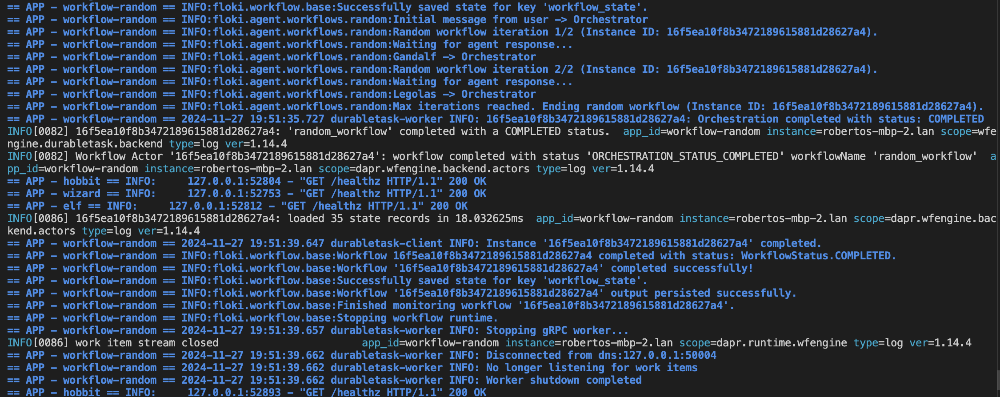
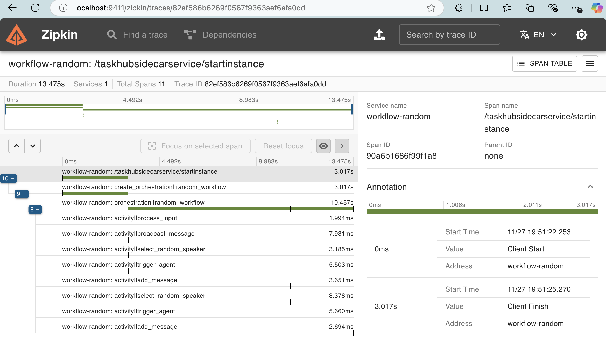

# Event-Driven Agentic Workflows

!!! info
    This quickstart requires `Dapr CLI` and `Docker`. You must have your [local Dapr environment set up](../installation.md).

Event-Driven Agentic Workflows in `Floki` take advantage of an event-driven system using pub/sub messaging and a shared message bus. Agents operate as autonomous entities that respond to events dynamically, enabling real-time interactions and collaboration. These workflows are highly adaptable, allowing agents to communicate, share tasks, and reason through events triggered by their environment. This approach is best suited for decentralized systems requiring dynamic agent collaboration across distributed applications.

## Agents as Services
In `Floki`, agents can be exposed as services, making them reusable, modular, and easy to integrate into event-driven workflows. Each agent runs as a microservice, wrapped in a [Dapr-enabled FastAPI server](https://docs.dapr.io/developing-applications/sdks/python/python-sdk-extensions/python-fastapi/). This design allows agents to operate independently while communicating through [Dapr’s pub/sub](https://docs.dapr.io/developing-applications/building-blocks/pubsub/pubsub-overview/) messaging and interacting with state stores or other services.

The way to structure such a project is straightforward. We organize our services into a directory that contains individual folders for each agent, along with a components/ directory for Dapr configurations. Each agent service includes its own app.py file, where the FastAPI server and the agent logic are defined.

```
components/                # Dapr configuration files
├── statestore.yaml        # State store configuration
├── pubsub.yaml            # Pub/Sub configuration
└── ...                    # Other Dapr components
services/                  # Directory for agent services
├── agent1/                # First agent's service
│   ├── app.py             # FastAPI app for agent1
│   └── ...                # Additional agent1 files
│── agent2/                # Second agent's service
│   ├── app.py             # FastAPI app for agent2
│   └── ...                # Additional agent2 files
└── ...                    # More agents
```

## Your First Service

Let's start by definining a `Hobbit` service with a specific `name`, `role`, `goal` and `instructions`.

```
services/                  # Directory for agent services
├── hobbit/                # Hobbit Service
│   ├── app.py             # Dapr Enabled FastAPI app for Hobbit
```

Create the `app.py` script and provide the following information.

```python
from floki import Agent, AgentService
from dotenv import load_dotenv
import asyncio
import logging

async def main():
    try:
        # Define Agent
        hobbit_agent = Agent(
            role="Hobbit",
            name="Frodo",
            goal="Take the ring to Mordor",
            instructions=["Speak like Frodo"]
        )
        # Expose Agent as a Service
        hobbit_service = AgentService(
            agent=hobbit_agent,
            message_bus_name="messagepubsub",
            agents_state_store_name="agentstatestore",
            port=8001,
            daprGrpcPort=50001
        )
        await hobbit_service.start()
    except Exception as e:
        print(f"Error starting service: {e}")

if __name__ == "__main__":
    load_dotenv()

    logging.basicConfig(level=logging.INFO)

    asyncio.run(main())
```

Now, you can define multiple services following this format, but it's essential to pay attention to key areas to ensure everything runs smoothly. Specifically, focus on correctly configuring the components (e.g., `statestore` and `pubsub` names) and incrementing the ports for each service.

Key Considerations:

* Ensure the `message_bus_name` matches the `pub/sub` component name in your `pubsub.yaml` file.
* Verify the `agents_state_store_name` matches the state store component defined in your `statestore.yaml` file.
* Increment the port for each new agent service (e.g., 8001, 8002, 8003).
* Similarly, increment the `daprGrpcPort` for each service (e.g., 50001, 50002, 50003) to avoid conflicts.
* Customize the Agent parameters (`role`, `name`, `goal`, and `instructions`) to match the behavior you want for each service.

## The Agentic Workflow Service

The Agentic Workflow Service in Floki extends workflows to orchestrate communication among agents. It allows you to send messages to agents to trigger their participation and monitors a shared message bus to listen for all messages being passed. This enables dynamic collaboration and task distribution among agents.

Types of Agentic Workflows:

* **Random**: Distributes tasks to agents randomly, ensuring a non-deterministic selection of participating agents for each task.
* **RoundRobin**: Cycles through agents in a fixed order, ensuring each agent has an equal opportunity to participate in tasks.
* **LLM-based**: Leverages an LLM to decide which agent to trigger based on the content and context of the task and chat history.

Next, we’ll define a `Random Agentic Workflow Service` to demonstrate how this concept can be implemented.

```python
from floki import RandomWorkflowService
from dotenv import load_dotenv
import asyncio
import logging

async def main():
    try:
        random_workflow_service = RandomWorkflowService(
            name="Orchestrator",
            message_bus_name="messagepubsub",
            agents_state_store_name="agentstatestore",
            workflow_state_store_name="workflowstatestore",
            port=8004,
            daprGrpcPort=50004,
            max_iterations=2
        )

        await random_workflow_service.start()
    except Exception as e:
        print(f"Error starting service: {e}")

if __name__ == "__main__":
    load_dotenv()

    logging.basicConfig(level=logging.INFO)
    
    asyncio.run(main())
```

Unlike `Agents as Services`, the `Agentic Workflow Service` does not require an agent parameter since it orchestrates communication among multiple agents rather than representing a single agent. Instead, the configuration focuses on workflow-specific parameters:

* **Max Iterations**: Defines the maximum number of iterations the workflow will perform, ensuring controlled task execution and preventing infinite loops.
* **Workflow State Store Name**: Specifies the state store used to persist the workflow’s state, allowing for reliable recovery and tracking of workflow progress.

These differences reflect the distinct purpose of the Agentic Workflow Service, which acts as a centralized orchestrator rather than an individual agent service.

## The Multi-App Run template file

The Multi-App Run Template File is a YAML configuration file named `dapr.yaml` that allows you to run multiple applications simultaneously. This file is placed at the same level as the `components/` and `services/` directories, ensuring a consistent and organized project structure.

```
dapr.yaml                  # The Multi-App Run template
components/                # Dapr configuration files
├── statestore.yaml        # State store configuration
├── pubsub.yaml            # Pub/Sub configuration
└── ...                    # Other Dapr components
services/                  # Directory for agent services
├── agent1/                # First agent's service
│   ├── app.py             # FastAPI app for agent1
│   └── ...                # Additional agent1 files
│── agent2/                # Second agent's service
│   ├── app.py             # FastAPI app for agent2
│   └── ...                # Additional agent2 files
└── ...                    # More agents
```

Following our current scenario, we can set the following `Multi-App Run` template file:

```yaml
# https://docs.dapr.io/developing-applications/local-development/multi-app-dapr-run/multi-app-template/#template-properties
version: 1
common:
  resourcesPath: ./components
  logLevel: info
  appLogDestination: console
  daprdLogDestination: console

apps:
- appId: HobbitApp
  appDirPath: ./services/hobbit/
  appPort: 8001
  command: ["python3", "app.py"]
  daprGRPCPort: 50001

- appId: WizardApp
  appDirPath: ./services/wizard/
  appPort: 8002
  command: ["python3", "app.py"]
  daprGRPCPort: 50002

- appId: ElfApp
  appDirPath: ./services/elf/
  appPort: 8003
  command: ["python3", "app.py"]
  daprGRPCPort: 50003

- appId: WorkflowApp
  appDirPath: ./services/workflow-random/
  appPort: 8004
  command: ["python3", "app.py"]
  daprGRPCPort: 50004
```

## Starting All Service Servers

!!! tip
    Make sure you have your environment variables set up in an `.env` file so that the library can pick it up and use it to communicate with `OpenAI` services. We set them up in the [LLM Inference Client](llm.md) section

To start all the service servers defined in your project, you can use the Dapr CLI with the Multi-App Run template file. When you provide a directory path, the CLI will look for the dapr.yaml file (the default name for the template) in that directory. If the file is not found, the CLI will return an error.

To execute the command, ensure you are in the root directory where the dapr.yaml file is located, then run:

```bash
dapr run -f .
```

This command reads the dapr.yaml file and starts all the services specified in the template.

## Start Workflow via an HTTP Request

Once all services are running, you can initiate the workflow by making an HTTP POST request to the Agentic Workflow Service. This service orchestrates the workflow, triggering agent actions and handling communication among agents.

Here’s an example of how to start the workflow using `curl`:

```bash
curl -i -X POST http://localhost:8004/RunWorkflow \
    -H "Content-Type: application/json" \
    -d '{"message": "How to get to Mordor? Let's all help!"}'
```

In this example:

* The request is sent to the Agentic Workflow Service running on port 8004.
* The message parameter is passed as input to the workflow, which the agents will process.
* This command demonstrates how to interact with the Agentic Workflow Service to kick off a new workflow.

If you check the console where you started all the service servers, you will see the following output once the system reaches its maximum number of iterations.



## Monitor Workflow Execution

As mentioned earlier, when we ran dapr init, Dapr initialized, a `Zipkin` container instance, used for observability and tracing.
We can use the Zipkin container to monitor our workflow execution. To do this, open your browser and go to `http://localhost:9411/zipkin/`. From there:

Click on `Find a Trace` and then `Run Query` to search for traces.


Select the trace entry with multiple spans labeled `<workflow name>: /taskhubsidecarservice/startinstance.`

When you open this entry, you’ll see details about how each task or activity in the workflow was executed. If any task failed, the error will also be visible here.


